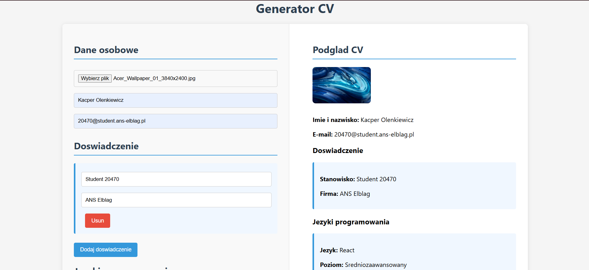
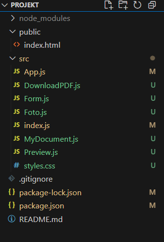
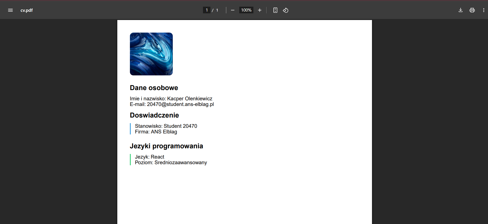

## Opis projektu

Aplikacja React do tworzenia i pobierania własnego CV w formacie PDF.  
Pozwala na wprowadzenie danych osobowych, doświadczenia zawodowego, języków programowania oraz dodanie własnego zdjęcia.  
Podgląd CV jest widoczny na żywo, a gotowy dokument można pobrać jako plik PDF.

---

## Funkcje

- ✅ Dynamiczny formularz do wprowadzania danych
- ✅ Dodawanie/Usuwanie doświadczenia zawodowego
- ✅ Dodawanie/Usuwanie języków programowania z poziomem zaawansowania
- ✅ Dodawanie własnego zdjęcia do CV
- ✅ Podgląd CV na żywo
- ✅ Pobieranie CV w formacie PDF (przyjazny dla rekruterów)
- ✅ Prosty, czytelny kod – idealny dla początkujących

---

## Instrukcja instalacji

1. **Sklonuj repozytorium:**
2. **Zainstaluj zależności:**
   npm install
3. **Zainstaluj dodatkowe pakiety do generowania PDF:**
npm install @react-pdf/renderer file-saver
4. **Uruchom aplikację:**
npm start

---

## Przewodnik użytkowania

1. Wprowadź swoje dane osobowe i e-mail.
2. Dodaj doświadczenie zawodowe (przycisk "Dodaj doswiadczenie").
3. Dodaj języki programowania i wybierz poziom.
4. Dodaj zdjęcie (przycisk "Wybierz plik").
5. Sprawdź podgląd CV po prawej stronie.
6. Kliknij "Pobierz CV w PDF", aby wygenerować i pobrać dokument.

---

## Struktura plików

---

## Technologie

- [React](https://react.dev/)
- [@react-pdf/renderer](https://react-pdf.org/) – generowanie PDF
- [file-saver](https://github.com/eligrey/FileSaver.js/) – pobieranie plików
- CSS (prosty, responsywny styl)

---

## Screenshot

---

## Licencja

Projekt open-source, do dowolnego wykorzystania edukacyjnego i prywatnego.

---

**Miłego korzystania!**

